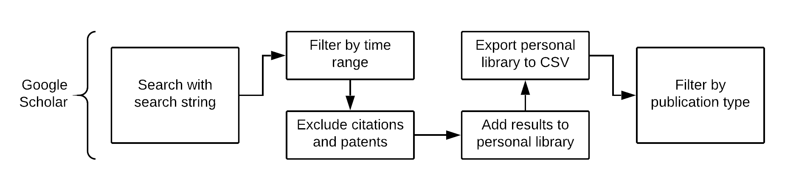
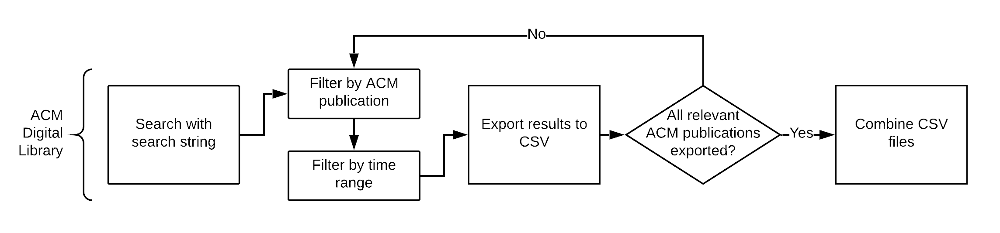
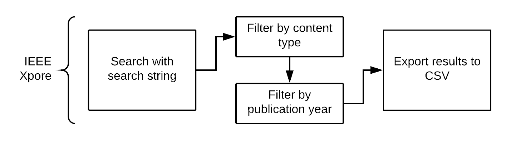
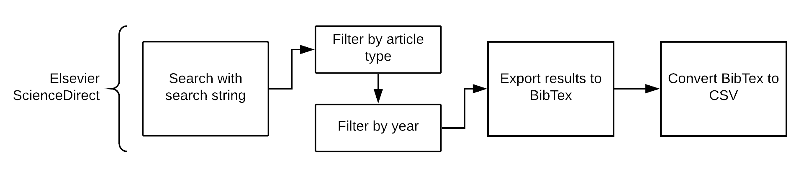

# SLR Summary

## SLR Overview
[Step 1.](#step-1-conduct-the-initial-searches) Run searches, filter by content type, year then export to CSV.

[Step 2.](#step-2-convert-csv-files-to-excel-spreadsheets) Convert CSV files to a human-readable format (Excel spreadsheet).

[Step 3.](#step-3-remove-duplicates) Remove duplicates within and cross platform.
   
[Step 4.](#step-4-manual-filtering) Filter by in-/exclusion criteria manually.
   
[Step 5.](#step-5-snowballing) Do one iteration of backwards snowballing.
   
[Step 6.](#step-6-filter-snowballed-literature) Remove duplicates and repeat step 4 for snowballed literature.
   
[Step 7.](#step-7-find-papers-with-open-data-sets) Find studies with open data sets within the remaining literature.
   
[Step 8.](#step-8-extract-data-sets) Extract the data sets and code snippets.

## Step 1: Conduct the initial Searches

### 1.1 Google Scholar
#### Search String
```
allintitle: (code OR software OR program) AND (understandability OR comprehension OR readability OR complexity OR analyzability OR "cognitive load")
```
#### Search and Export Procedure
1. Change Google Scholar settings to display 20 results per page
2. Use the web search with the search string
3. Filter by excluding patents, citations and set 2010-now as custom year range
4. Go through every search result and click "Add to library" __*1__
5. Go into "My library" and export all results to BibTex one page at a time __*2__
6. Drag\&Drop all BibTex files into JabRef
7. Save JabRef library as bib file.
8. Import bib file into Zotero. __*3__
9. Export library as CSV.

__*1__: When going through the pages one by one Google might lock your IP because you made too many requests. This can normally be resolved by completing a Google captcha. (Usually one comes up when attempting a normal Google search after being locked out.)

__*2__: Direct export to CSV from Google Scholar is not used because the the entrytype field gets lost which increases filtering effort later on. (Scholar marks thesises and book entries when exporting to bibtex)

__*3__: Exporting the library from JabRef to CSV directly causes a faulty CSV file. Exporting from bib to CSV with Zotero works properly. Because Zotero does not allow the import of multiple .bib files at once, a combined approach, as explained above, is the quickest.



### 1.2 ACM Digital Library
- Use web search with search string:
```
acmdlTitle:((code OR software OR program) AND (understandability OR comprehension OR readability OR complexity OR analyzability OR "cognitive load"))
```
- Filter by ACM Publications:
  - Include: Proceeding, Journal __*1__
  - Exclude: Newsletter, Magazine, Book
- Filter by Year:
  - Include 2010 to now
- Export results to .csv with on-site functionality
- Combine the 2 .csv files into one by copying entries without header line from one file to the other.

__*1__: Only one ACM Publication type can be selected at once, so "Proceeding" and "Journal" type entries have to be exported separately resulting in 2 .csv files.



### 1.3 IEEE Xplore
- Use web search with search string:
```
("Document Title":code OR "Document Title":software OR "Document Title":program) AND ("Document Title":understandability OR "Document Title":comprehension OR "Document Title":readability OR "Document Title":complexity OR "Document Title":analyzability OR "Document Title":"cognitive load")
```
- Filter by content type:
  - Include: Conferences, Journals & Magazines, Early Access Articles
  - Exclude: Books, Courses, Standards
- Filter by Year:
  - Include 2010 to now
- Export to .csv with on-site functionality
  - If less than 2000 results: just use standard export to .csv (This ended up being the case.)
  - If more than 2000 results: Show 100 results per page, select all entries on page, export entries, repeat for all pages



### 1.4 Elsevier ScienceDirect
- Use Advanced Search, click "Show all fields" and enter this search string in the "Title" field:
```
(code OR software OR program) AND (understandability OR comprehension OR readability OR complexity OR analyzability OR "cognitive load")
```
- Filter by article types:
  - Include: Review articles, Research articles, Data articles
  - Exclude: Encyclopedia, Book chapters, Conference abstracts, Book reviews, Case reports, Conference info, Correspondence, Discussion, Editorials, Errata, Examinations, Mini reviews, News, Patent reports, Practice guidelines, Product reviews, Short communications, Software publications, Video articles, Other
- Export results
  - Display 100 results per page, select all results on the page, export to Bibtex, repeat for all pages.
  - Convert .bib file to .csv file with reference manager (Jabref or similar)
    1. Drag & Drop BibTex file into JabRef.
    2. Save JabRef library as .csv file.
    3. Repeat for all .bib files.
    4. Combine 2 .csv files by copying entries without header line from one file to the other.



## Step 2: Convert CSV Files to Excel Spreadsheets
Conversion Procedure
  1. Open Excel
  2. New empty spreadsheet
  3. Data > From Text/CSV
  4. Select CSV file > Import
  5. File Origin: 65001: Unicode (UTF-8); Deliimiter: Comma; Data Type Detection: Based on first 200 rows
  6. Load
  7. Save as XLSX file (Excel-Spreadsheet)

## Step 3: Remove Duplicates
### 3.1: Remove duplicates within each platform
- Remove exact duplicates from each source
  1. Select column containing document title.
  2. Use "Conditional Formatting" to highlight cells with duplicate values.
  3. Remove actual duplicates from the highlighted entries. (Use other columns such as Year, Author, Publication to be sure) __*1__

__*1__: Sorting the entries by alphabet can make this process easier.

### 3.2 Remove cross-platform duplicates
- Copy paste entries from other sources into the table where you want to remove the duplicates from. __*1__
- Repeat the procedure described in 3.1. Once you've removed all actual duplicates from the current source, you can again remove the entries you just copied into its spreadsheet.
- Entries from the sources in parentheses are copied into the table of the sources where you want to remove the duplicates from.
  - Remove duplicates from Google Scholar      (ACM, IEEE, ScienceDirect).
  - Remove duplicates from ACM Digital Library      (IEEE, ScienceDirect).
  - Remove duplicates from IEEE Xplore                    (ScienceDirect).

__*1__: Make sure the document title columns align to allow automatic marking of duplicates.

## Step 4: Manual Filtering
- Go through each entry one-by-one and first by looking at the title, then abstract and in extreme cases the full-text.
- Check their suitability by using each filtering criterion:
  - written in english
  - related to the field of software engineering
  - full-text available
  - published in peer-reviewed journals or conference and workshop proceedings
  - primary research, conducting an experiment, survey, case study, observation, interviews, ...
  - as part of their study, the authors 
  	- measure the understandability of source code (not GUIs, documentation, UML diagrams or other software related artifacts)
  	- from a human developer's point of view

While this is the general approach, Google Scholar requires special treatment:
  - Remove entries with the item type book, bookSection and thesis since they don't fit the peer-reviewed publication requirement.
  - Since Google Scholar aggregates from all kinds of different sources, it is especially important to make sure that the literature was published in peer-reviewed journals/workshops. However, it can require quite a bit of effort to look up each publication and their review process. Because of this, I recommend doing this step last after all other filtering criteria were passed.

To make the filtering process more manageable it can be useful to identify certain key words that often appear in irrelevant papers and apply a filter to show only these. This way the work load is split up into smaller chunks and it is possible to work keyword by keyword. Note: This does not reduce the total workload since each entry still has to be looked at manually (Only use filtering to change which entries are temporarily displayed, NOT to remove entries) but it can make the filtering process a bit more pleasant.

In a future literature search, one might want to identify these keywords in a preliminary search and add them to the search string (with the operator NOT or -) to reduce the initial amount of irrelevant papers in the search results.

## Step 5: Snowballing
- Do one iteration of backward snowballing by looking at each paper and copying the references.
- Copy references section from each pdf to a text file.
- Then copy the entries into an excel spreadsheet.

There are two ways to copy the entries:
1. You only copy the titles into the excel spreadsheet and consult the text file if additional metadata for an entry is needed later on (for removing duplicates and filtering).
2. You create a spreadsheet with columns for the full metadata and add the metadata for each entry into the spreadsheet. (This requires a lot more effort in the initial creation but makes removing duplicates and filtering more comfortable)

## Step 6: Filter snowballed literature
1. Repeat the steps described in step 3 to remove duplicates from the snowballed literature.
2. Repeat the manual filtering steps explained in step 5 for the remaining papers.
  - Do NOT remove papers that were published before 2010.
  - Don't forget to check the publication type (peer-reviewed journals or workshop proceedings).

## Step 7: Find papers with open data sets
We explore the full-text of each paper to identify whether they have a publicly published data set.
If there is no publicly published data set, consider contacting the authors.
They oftentimes will be ready to share their results with you.

## Step 8: Extract data sets
Build a new spreadsheet with:
- Paper reference data: title, year, author, publication type, country of origin, institution
- Data set properties: programming language, number of code snippets, number of study paricipants, analyzed code metrics, understandability measures, comprehension tasks, study demographic (students? experts?)
- Date of data extraction

Also store:
- The actual data set with code snippets